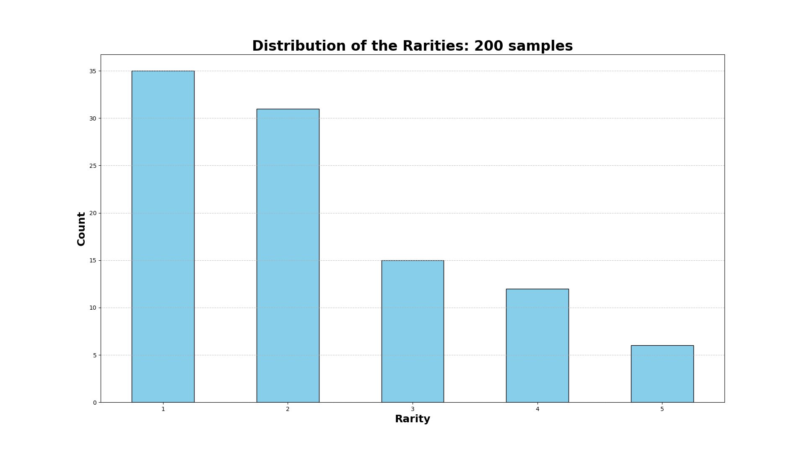
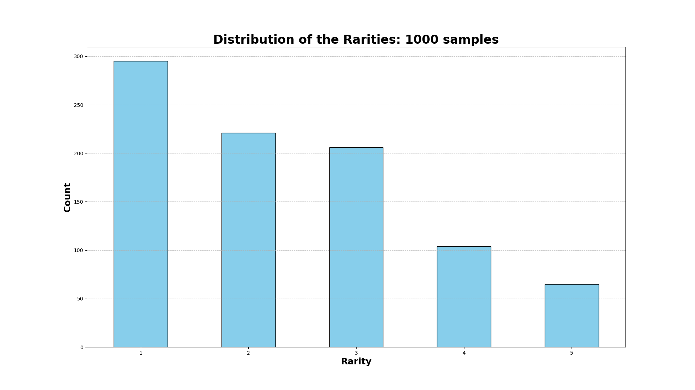
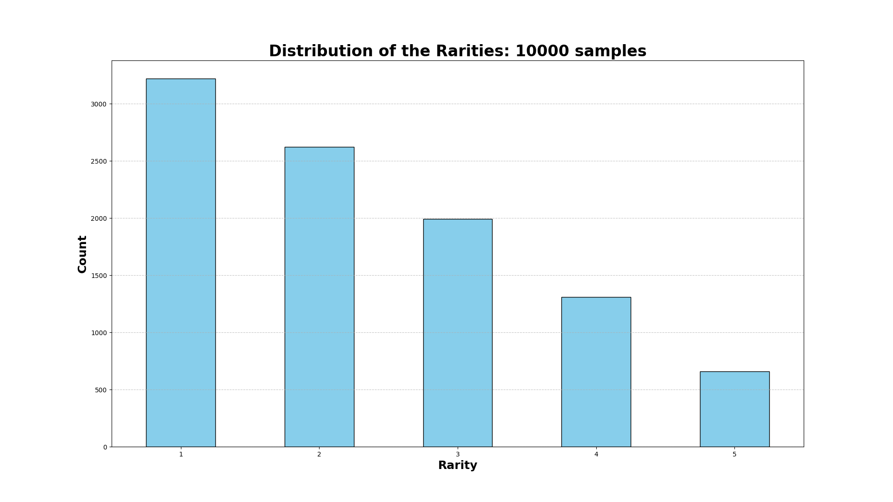

# 24/25 ASE project

|    Collaborators   |
|:------------------:|
|   Filippo Fornai   |
|     Luca Rizzo     |
| Leonardo Scoppitto |
|  Simone Stanganini |


# Get started

To start the project just clone the repo and:

```bash
cd ase-project/src
./run_backend.sh
```

By default the two gateways will listen on port `8080` (normal users) and `8180` (admins). Now you can start locust in the same directory to start the performance testing.
**Please note:** It is possible to start the services with `docker compose up`, but remember to execute `docker compose down` before starting any other compose file, otherwise there could be some container name conficts. The `run_backend.sh` script handles the cleanup for you.

To start the integration tests, stop all running containers, head over to `src/integration_tests` and execute the `run_tests.sh` script.
This will start the dockerized version of `newman` along with the service container and will perform the integration tests in a production environment.
To run individual tests, just move inside the service directory of choice and type:

```bash
# From the root directory of the project
cd src/tux_service # replace tux_service with auction_service, authentication_service, gacha_service
bash run_tests.sh
```

This will start the dockerized version of `newman` along with the service container and will perform the unit/feature tests in a mocked/test environment.

# Rarity check

Inside docs there is the `rarity_graph` directory that contains the script to compute the probability distribution for each rarity level and the images (also reported here) of the results.




